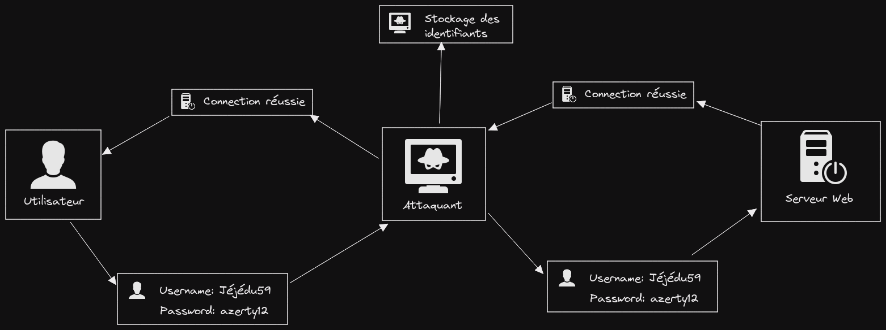

# Stratégie de Sécurisation d'une application

# Table des matières

- Principes de sécurité
    - Défense en profondeur 
    - Réduction surface d'attaque 
    - Moindre privileges 
    - Politique sécurité des mots de passe 
- Protocoles
    - HTTP
        - Faille relatives : 
            - MITM (Man In The Middle)
    - HTTPS
        - TLS
    - HSTS 
    - HSTS Preload
- Sécurité navigateur
    - SOP 
    - CORS 
    - CSP 
    - SRI 
    - Sanitisation 
    - Cookies 
    - Authentification 
        - Failles relatives :
            - XSS 
                - Clickjacking 
                - Requêtes silencieuses 
            - CSRF 
            - SQLI 
            - Point d'eau 
- Sécurité backend
    - RBAC 
    - DDOS (Deni de service) 
    - Autorisation 
    - Journalisation 
    - Sécurisation des mots de passe 
        - SHA256 
            - Hashage
            - Salage  
    - Sécurisation authentification
        - JWT
        - Token
        - Session
        - UUID
    - Sécurisation API 
    - Stratégie de sauvegarde 
    - Strict mode 
    - Failles relatives : 
        - SSRF 
- Annexe
    - RGPD 
    - Audit 
    - Bug Bounty 

# Principes de sécurité

## Défense en profondeur

Le principe de défense en profondeur consiste simplement à ne pas protéger une seul point d'entrée 
mais bien l'ensemble des éléments consistuant un système ou une application afin que chacun 
de ces éléments participent activement à la sécurité générale du système ou de l'application. 

## Réduction de la surface d'attaque

La réduction de la surface d'attaque est un principe de sécurité selon lequel toutes les parties d'une application ou d'un système non necessairement exposables seront isolés. 
C'est à dire que chaque partie du système ou de l'application dont l'exposition peut-être réduite doit l'être. 
 
Par exemple :  
Lors-ce que nous développerons pour le Web, nous pourrions réduire la surface d'attaque en n'exposant que les ports 
80, 443, 20 ( ou 21) afin que le système ne soit exposés sur le réseau que par le biais de ces ports.

## Moidre privilèges

Le principe de moindre privilèges consiste à restreindre les permissions d'un élément aux permissions strictement nécessaire à son bon fonctionnement. 
Par exemple, si un composant doit simplement lire un flux d'informations, nous autoriserons ce composant à lire mais sans lui permettre d'écrire dans les flux qu'il sera amené à lire. 

## Politique des mots de passe

Une politique de mot de passe est un ensemble de recommandations à suivre afin d'établir une certaines sécurié concernant les mots de passe possiblement entrés par les utilisateurs. 
Dans le cadre de cette strategie, la politique des mots de passes sera la suivante : 

- Une longueur comprise entre 8 et 80 caractères.
- Une composition (A-z, 0-9, caractères spéciaux sans exception) des mots de passe.
- La vérification de la robustesse du mot de passe entré en temps réel par la vérification des facteurs ci-dessus.
- Un tente d'attente de 2 minutes par tranche de 3 tentatives de connexions échouées.
- Une stratégie de recouvrement par le biais d'un lien envoyé par mail afin de regénerer un mot de passe.
 
# Sécurité par les protocoles

## HTTP

Le protocol HTTP est un protocol d'échange de donnée s'insérant sur la couche réseau du modèle OSI. 
HTTP signifie HyperText Transfer Protocol ou en français Protocol de Transfert d'HyperText. 
Nous n'utiliserons pas ce protocol en raison de son manque de protection lros du transfer d'information. 
Ce protocol étant soumis à une faille de sécurité majeure (MITM) il sera préférable d'utiliser le protocol HTTPS. 

### MITM (Man In The Middle)

L'attaque dites de Man In The Middle ou literallement L'homme du millieu est une attaque qui consiste à se placer entre les deux machines communiquantes entre elles tel qu'un Client et un Serveur par exemple afin de récupérer les échanges d'informations émises et reçues.  
Prenons un exemple concret: 
 
Dans cet exemple l'utilisateur ne s'est même pas rendu compte qu'un attaquant avait récupéré ses informations de connexion à son site favori. 
Tout comme le serveur ne s'est rendu compte de rien, l'attaquant n'étant qu'un émetteur de plus à qui répondre. 
Avec l'attaque par MITM il est possible d'aller bien plus loin, par exemple falsifier le contenu renvoyé par le site Web afin de faire éxécuter à l'utilisateur du code malveillant pouvant avoir des impacts sur d'autres sites par le biais d'ajout de requêtes silencieuses par exemple. 
L'attaque par MITM est réellement dangereuse et mériterait une documentation à part entière comme de nombreuses failles dont nous allons parler dans cette documentation.

## HTTPS

Le protocol HTTPS est une version améliorée du protocol HTTP en terme de sécurité. 
HTTPS signifie HyperText Transfer Protcol Secure ou en français Protocol Sécurisé de Transfert d'HyperText. 
Ce protocol se repose en réalité sur un autre protocol afin de sécurisé l'échange de données, le protocol TLS. 
Nous utiliserons ce protocol d'échange de données car il n'est plus vulnérable aux attaques MITM. 

### TLS 

Le protocol TLS est un protocol visant à encapsuler l'information et à la chiffrer par le biais d'opérations cryptographiques. 
TLS signifie Transport Layer Security ou en français Sécurité de la Couche de Transport. 
TLS permet de chiffrer les informations émises dans un contexte d'échange type Client -> Serveur afin d'empêcher la compromission des informations transitantes sur la couche réseau. 
Dans le cadre de l'utilisation de TLS le serveur est nécessairement authentifié, alors qu'il existe certaines fonctions permettant l'identification du client si besoin est. 
Notons aussi que TLS est l'une des solutions préférées dans la protection de flux réseau. 
Lors de l'utilsation de TLS, les messages sont généralement transmis par l'intermediaire du protocol TCP. 
<a href="https://www.ssi.gouv.fr/uploads/2020/03/anssi-guide-recommandations_de_securite_relatives_a_tls-v1.2.pdf">Afin d'en apprendre beaucoup plus sur TLS</a>

## HSTS

HSTS est un méchanisme visant à effectuer des redirections de requêtes utilisant le protocol HTTP vers un protocol sécurisé tel que HTTPS afin d'éviter la communication par le biais d'un protocol non sécurisé tel qu'HTTP. 
HSTS signifie HTTP Strict Transport Security. 
Cependant en cas d'utilisation d'HSTS il est fortement recommandé de vérifier les dates d'expiration des certificats SSL/TLS fournissant l'accès au protocol HTTPS, en effet, en cas d'oubli de renouvellement du certificat, l'utilisation d'HSTS empêchera l'entiereté des visiteurs à consulter votre site. 
Aussi il existe une vulnérabilité lors de la première visite d'un site utilisant HSTS, en effet, HSTS ne prends pas en compte la première visite d'un utilisateur lors de sa première visite, c'est à dire qu'il existe un risque minime qu'un utilisateur soit victime d'une attaque par MITM, il existe cependant un moyen de rémédier à cette vulnérabilité. 

Dans le cadre du projet de la Mission Locale ce mechanisme sera mis en place. 

## HSTS Preload

HSTS Preload est enfaite un registre contenant une liste de domaine, permettant aux navigateurs d'enregistrés les domaines au HSTS préalablement à la première visite d'un utilisateur, de ce fait, tout domaine enregistré dans le Preload est garantit d'être connu du navigateur et par la même occasion de ne plus souffrir de cette vulnérabilité lors de la première visite d'un utilisateur. 

Dans le cadre du projet de la Mission Locale, le domaine sera enregistré au Preload. 

# Sécurité côté Navigateur

## SOP (Same Origin Policy)

La politique de même origin est une sécurité mise en place par défaut par le navigateur, 
cette politique permet de définir que l'origin sur laquelle vous vous trouvez sera en quelques sortes cloisonnée, 
et sera hermétique aux autres origin se trouvant sur le Web, avec SOP votre origin ne pourra pas échanger de ressources 
avec les autres origins se trouvant sur le Web, il existe cependant quelques exceptions telles que les images et les iframes. 

Dans le cadre de ce projet, SOP ne sera pas utilsé puis-ce qu'il semble nécessaire d'échanger des ressources avec les partenaires de la Mission Locale. 

## CORS (Cross Origin Ressources Sharing)

Cross Origin Ressources Sharing (CORS) ou Partage de Ressources Inter-Origin est une sécurité permettant d'échanger des ressources 
entre différentes origins, de cette façons, il sera possible de récupérer des informationss sur des sites partenaires, cependant grace à CORS il est possible d'établir une liste de domaine avec lesquels échanger des informations. 
Pour qu'un échange de données entre origin puisse avoir lieu avec CORS, il est nécessaire que les 2 domaines acceptent l'échange l'un avec l'autre, sans quoi l'échange de donnée n'aura pas lieu. 

Dans le cadre du projet de la Mission Locale, CORS sera mis en place afin d'échanger des contenus provennant de partenaires. 

## CSP (Content Security Policy)

La Politique de Sécurité du Contenu (CSP) est une politique mise en place par le navigateur, 
grace à CSP il est possible de dresser une liste de ressources dont l'execution sera authoriser, 
a l'inverse si une ressource importée d'un autre domaine par le biais de CORS ne se trouvant pas dans la liste de CSP, 
cette dernière verrait son importation ou son execution bloquée par le navigateur afin de prévenir l'injection de code par exemple. 
De ce fait, CSP permet d'endiguer en partie les failles de type XSS, cependant, CSP ne représente pas une contre-mesure suffisante à ce type de faille et ne doit donc pas se substituer à de bonnes pratiques en matière de développement. 

Dans le cadre de ce projet, CSP sera mis en place et configuré de façons à être le plus optimale possible. 

## SRI (SubRessources Integrity)

SRI est un système de vérification de l'Intégrité des Sous-Ressources, c'est à dire que grace à SRI il est possible de vérifier si une ressource est intègre ou non. 

Lors ce que nous allons importer des ressources, il peut-être intéressant d'avoir un moyen de vérifier que les dites-ressources correspondent effectivement à ce pour quoi elles ont étées prévues. 
Par exemple, lors d'import de library externe telles que Bootstrap, il est utile de vérifier que la librairie bootstrap importait correspond effectivement à ce dont elle doit correspondre. 
La vérification de l'intégrité d'une ressource se fait par le biais du Hashage, le principe est simple : 

Les développeurs de Bootstrap dévellopent une nouvelle version. 
Ils hash le fichier bootsrap.min.css, il récupèrent leur version du code sous forme de hash. 
Ils postent la nouvelle version de boostrap.min.css puis postent le hash. 
Lors de l'import de bootsrap un développeur importe la nouvelle version afin de l'utiliser sur son site. 
Et par la même occasion se munie du hash de cette dernière afin de vérifier que le code correspond bien au hash. 
Si c'est le cas, pas de soucis, la version est bonne et n'a subie aucune modification, sinon, la ressource ne correspond pas
au contenu importé, on n'utilisera pas cette ressource puis-ce que potentiellement dangereuse. 

## Sanitisation

La sanitisation est une solution permettant de nettoyer la donnée entrée par l'utilisateur, afin de ne pas permettre à un utilisateur d'entrer de chiffre dans un champ prévu pour un nom par exemple. 
Il existe une sanitisation côté front-end et côté back-end, la solution de sanitisation côté front-end est un premier rempart mais trop peu suffisant, avec la sanitisation côté front-end, il est possible de nettoyer l'information entrée par un utilisateur lambda, mais pour quelqu'un d'experimenté, il est assez aisé de supprimer la sanitisation côte front-end. 
C'est pourquoi la sanitisation côté back-end doit être mise en place, afin d'être assuré que les informations entrées sont conformes aux attentes et seront traitables. 

La sanitisation est un point essentiel, c'est pourquoi elle sera mise en place dans ce projet. 

## Cookies

Les cookies sont connotés de façon négatives par la plupart des utilisateurs car souvent présentés sous-forme de pop-ups génantes, demandant à l'utilisateur leurs autorisations afin de sauvegarder les préférences utilisateurs. 
Cependant les cookies sont très utiles pour stocker des informations concernant le compte d'un utilisateur, afin de ne pas forcer l'utilisateur à se reconnecter au site à chaque visite. 
Cependant, il existe des problèmes au niveau de la sécurité concernant les cookies, en effet, les failles de type XSS permettent la récupération des cookies contenues sur une page Web, c'est pourquoi il devient très décommandé d'utiliser simplement les cookies en guise de preuve de confiance. 
Dans la plupârt des cas ou la sécurité prime, le cookie n'est enfaite qu'une partie du stockage de la session d'un utilisateur. 
Il existe des alternatives afin de ne pas rendre le compte d'un utilisateur complétement vulnérable en cas d'attaque par le biais de XSS, ne les verrons un peu plus tard.<brs>